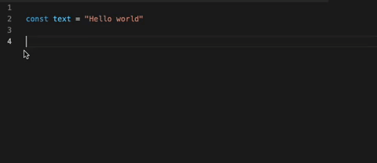

# vscode-extension-js-console

## Features

VSCode extension. Easily insert console statements., by N-Iwata[(@rpf_nob)](https://twitter.com/rpf_nob)

## Requirements

Visual Studio Code 1.60.0 later

## Installing

This extension is available for free in the [Visual Studio Code Marketplace](https://marketplace.visualstudio.com/items?itemName=N-Iwata.vscode-extention-js-console)

## Usage

With selection or cursor into the variable(Anything is OK):

- Press Cmd+Shift+L => The output on a new line will be: console.log('variable: ', variable);
- Press Cmd+Shift+T => The output on a new line will be: console.table(variable);
- Press Cmd+Shift+W => The output on a new line will be: console.warn('variable: ', variable);
- Press Cmd+Shift+E => The output on a new line will be: console.error('variable: ', variable);

Without selection:

- Press Cmd+Shift+L => The output on the same line will be: console.log();
- Press Cmd+Shift+T => The output on the same line will be: console.table();
- Press Cmd+Shift+W => The output on the same line will be: console.warn();
- Press Cmd+Shift+E => The output on the same line will be: console.error();

for windows Ctrl+Shift+・・・

## Contributing

### Pull requests

Feel free to make a pull request to the develop branch to fix any bugs or suggestions for improvement.

### Issues

Feel free to create an issue if you have any problems or requests for improvement.

## License

[MIT License](LICENSE)
